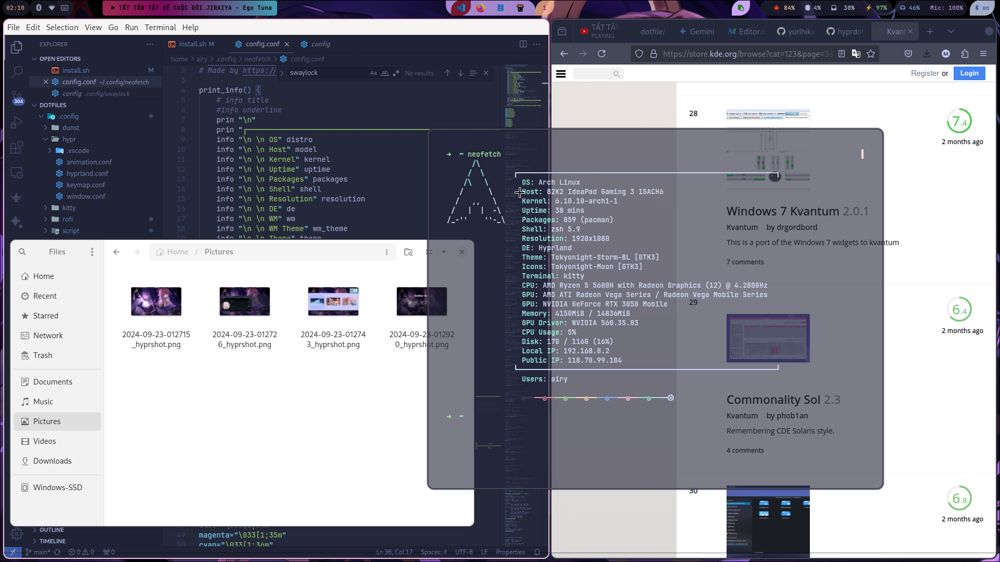
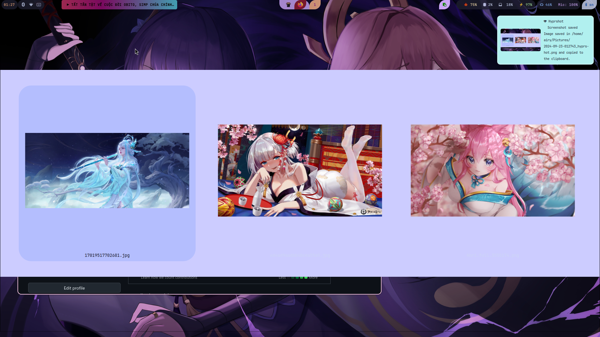
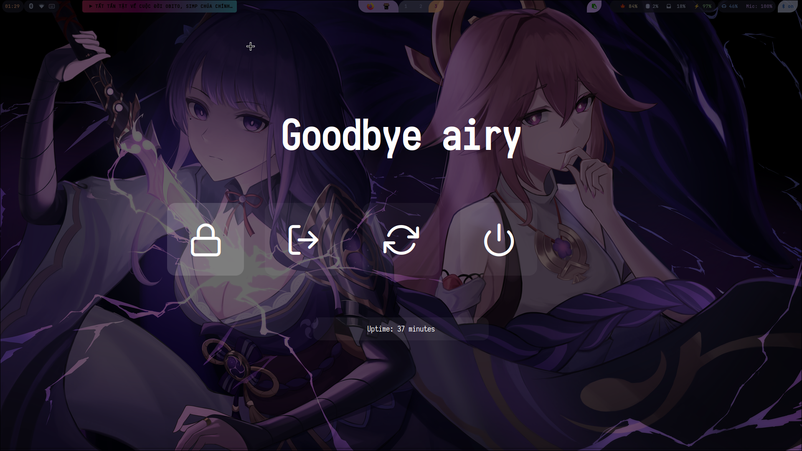

*Package*

> hyprland
> btop
> swaylock-effects
> hyprshot
> zsh
> sway
> network-manager-applet
> kitty
> blueman
> dunst rofi-lbonn-wayland-git
> jd-tool
> waybar
> swww
> cliphist
> polkit-kde-agent
> xdg-desktop-portal-hyprland
> brightnessctl
> pavucontrol
> pamixer
> nwg-look
> fcitx5-bamboo-git
> fcitx5-gtk
> fcitx5-configtool

[========]

*Images*


[========]

*auto Install(may be faulty)*

```bash
git clone https://github.com/meomeowth/dotfiles.git
cd ./dotfiles
./install.sh
```
*Normal install*
```bash
cd ./dotfiles
cp -r .config/* ~/.config
mkdir .local/share/fonnts
cp -r .local/share/fonnts/* ~/.local/share/fonnts
cp -r .icon ~/
cp -r .themes ~/
cp .zshrc ~/
```
